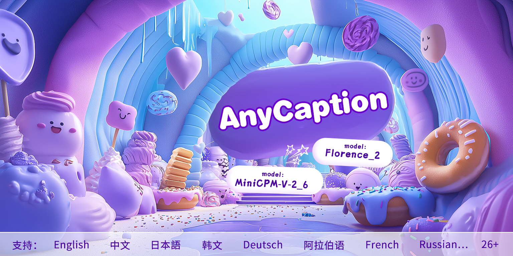
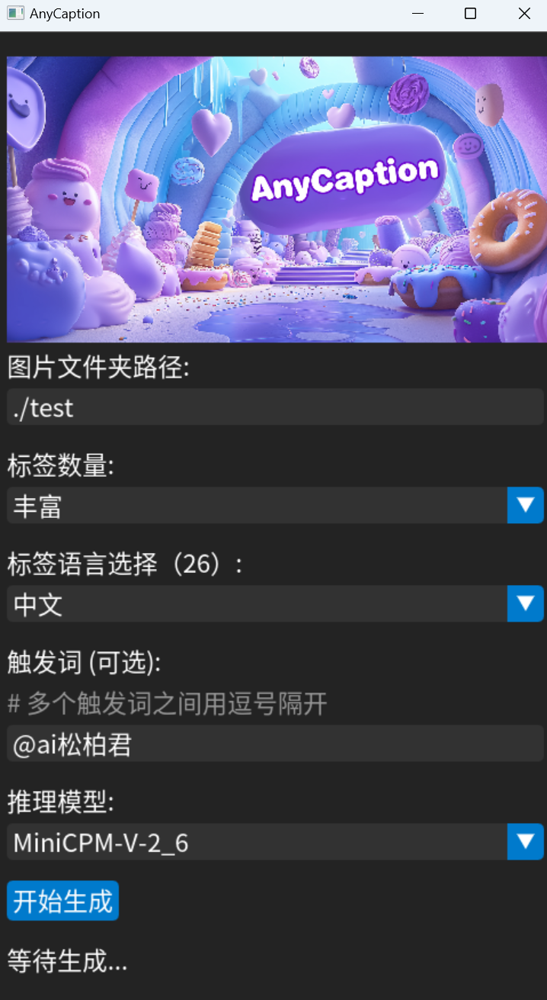

<p align="left">
    中文&nbsp;｜&nbsp;<a href="./readme_en.md">🌍 EN</a>&nbsp;
</p>

# AnyCaption

### 这是一个能够将图片内容推理为任何语言的标签工具，支持包括中文在内的26种语言。
___
<br>

## 一、部署方法：
1. 需要有conda，需要cuda12.1
2. ```conda create --name anycaption python=3.10.14```
3. ```conda activate anycaption```
4. ```pip3 install torch torchvision torchaudio --index-url https://download.pytorch.org/whl/cu121```
5. 打开终端，cd进项目文件夹内，输入：```pip install -r requirements.txt```
6. 下载模型
    1. mbart-large-50-many-to-many-mmt：
链接: https://pan.baidu.com/s/1Fw8kXYNPIMO9VJMpy2pRGA?pwd=3qsj 提取码: 3qsj。下载完将里面的模型放在“mbart-large-50-many-to-many-mmt”内。
    2. 下面两个模型可以都下载，也可以二选一：
        - Florence_2_large：
链接: https://pan.baidu.com/s/1Vczv6GOA9PjpaCJi2sPmRQ?pwd=zsmi 提取码: zsmi。下载完将模型放在Florence_2_large文件夹内；
        - MiniCPM-V-2_6：
链接: https://pan.baidu.com/s/1F-53qpFWEOjpoE26Lop8xQ?pwd=ifag 提取码: ifag。下载完将模型放在MiniCPM-V-2_6文件夹内。
7. 启动：```python AnyCaptionUI.py```
8. 你可以看到：

___
## 二、支持
1，语言：
```
"English","中文","日本語","韩文","Russian","French ","Deutsch","Español","Eesti","Suomi","阿拉伯语","Français","Italiano","Nederlands","Română","Türkçe","Afrikaans","Hrvatski","Bahasa Indonesia","Polski","Português","Svenska","Kiswahili","Xhosa","Galego","Slovenščina"
```

2，模型：
1. Florence_2_large(运行需要12GB显存) https://huggingface.co/microsoft/Florence-2-large
2. MiniCPM-V-2_6(运行需要20GB显存) https://huggingface.co/openbmb/MiniCPM-V-2_6/tree/main

___

## 三、开发计划
1. 即时的模型支持
2. 丰富标签处理工具
3. 图片分类工具

___

<br>
ai松柏君

📧：aisongbaijun@163.com 

X：[](https://x.com/songbai20)

B站主页：https://space.bilibili.com/523893438?spm_id_from=333.1007.0.0