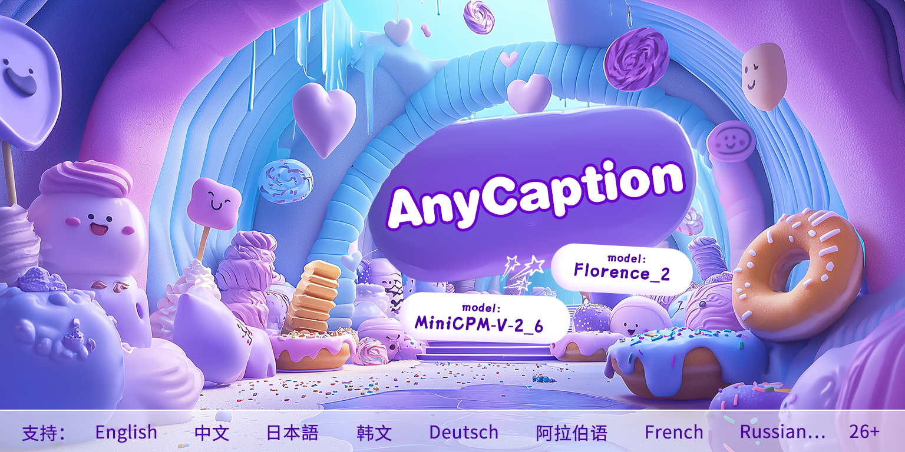
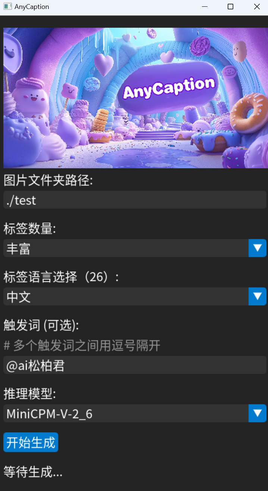

<p align="left">
    🌍 EN&nbsp;｜&nbsp;<a href="./readme.md">中文</a>&nbsp;
</p>

# AnyCaption

### This is a tagging tool that can infer image content into any language, supporting 26 languages including Chinese.

___
<br>

## Deployment:
1. required：Conda, CUDA12.1
2. ```conda create --name anycaption python=3.10.14```
3. ```conda activate anycaption```
4. ```pip3 install torch torchvision torchaudio --index-url https://download.pytorch.org/whl/cu121```
5. Open the terminal, CD into the project folder, and enter：```pip install -r requirements.txt```
6. Download Model
    1. mbart-large-50-many-to-many-mmt：
link: https://pan.baidu.com/s/1Fw8kXYNPIMO9VJMpy2pRGA?pwd=3qsj code: 3qsj。After downloading, place the model inside“mbart-large-50-many-to-many-mmt”。
    2. Both of the following models can be downloaded, or you can choose one from the other：
        - Florence_2_large：
link: https://pan.baidu.com/s/1Vczv6GOA9PjpaCJi2sPmRQ?pwd=zsmi code: zsmi。After downloading, place the model in the Florence_2_rarge folder;
        - MiniCPM-V-2_6：
link: https://pan.baidu.com/s/1F-53qpFWEOjpoE26Lop8xQ?pwd=ifag code: ifag。After downloading, place the model inside“MiniCPM-V-2_6”。
7. start: ```python AnyCaptionUI.py```
8. You can see that：

___
## Supporting 

languages：
```
"English","中文","日本語","韩文","Russian","French ","Deutsch","Español","Eesti","Suomi","阿拉伯语","Français","Italiano","Nederlands","Română","Türkçe","Afrikaans","Hrvatski","Bahasa Indonesia","Polski","Português","Svenska","Kiswahili","Xhosa","Galego","Slovenščina"
```

models：
1. Florence_2_large(Running requires 12GB VRAM) https://huggingface.co/microsoft/Florence-2-large
2. MiniCPM-V-2_6(Running requires 20GB VRAM)  https://huggingface.co/openbmb/MiniCPM-V-2_6/tree/main


___

## Attention

When inferring image labels, the images that failed the inference will be placed in the newly generated err_img folder, but in most cases, it will be successful. This is just a safety measure

___

## Development Plan
1. Instant model support
2. Enrich label processing tools
3. Image classification tool
___
<br>
ai松柏君

📧：aisongbaijun@163.com 

X：[](https://x.com/songbai20)

bilibili：https://space.bilibili.com/523893438?spm_id_from=333.1007.0.0